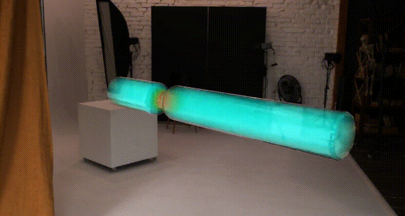
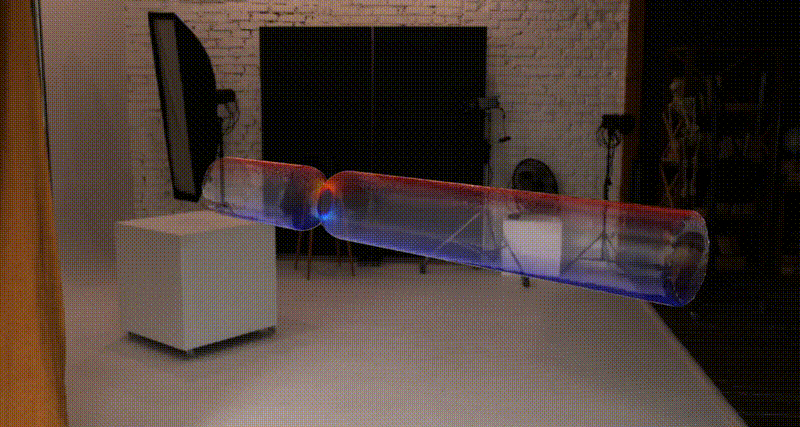

# Fluid Simulation with deal.II

A computational fluid dynamics (CFD) solver built with deal.II. This project implements stabilized finite element methods for solving the Navier–Stokes equations.

## Features

* Support for both 2D and 3D
* MPI parallelization support
* Custom boundary conditions

## Dependencies

* deal.II
* CMake
* MPI (OpenMPI, MPICH)
* HDF5 (IO)
* Gmsh (mesh generator)

---

## Getting Started

### How to run the demo code

#### 1) Build

Clone the repository and build using the provided script:

```bash
git clone https://github.com/KakeruUeda/fluid_sim_dealii.git
cd fluid_sim_dealii

cd script
sh build.sh
```

> **Note**
>
> * If needed, edit CMakeLists.txt and script/build.sh to match your local environment.
> * The build script is expected to generate the executable(s) under `build/` (e.g., `build/example/NavierStokesFlow`).


#### 2) Run

Run the demo in parallel with MPI:

```bash
cd example/demo
mpirun -n 8 ./../../build/example/NavierStokesFlow
```

> **Note**
>
> * You can change the number of MPI ranks by editing `-n 8`.
> * params.prm is loaded automatically at runtime, so you don’t need to pass it explicitly as a command-line argument.

---

## Example

### Flow through a tube (Reynolds number: 2000)

**Velocity Field**



**Vorticity Field**


